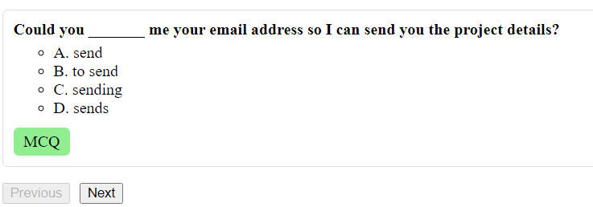

# QuestSearch

QuestSearch is a MERN (MongoDB, Express, React, Node.js) application created as a part of an assignment. It enables users to query a dataset stored in MongoDB, leveraging Express for backend server functionality and React for the client-side application.

This README outlines the step-by-step process of creating the project so far, focusing on the backend setup and data handling.

---

## **Project Output**

**Project URL**: `https://mern-questsearch.netlify.app/`

Here are screenshots of the `QuestSearch` application in action, demonstrating its core functionality:

*A clean interface with an input field to type queries and trigger searches.*


*Users can navigate through search results using pagination controls.*



*Used differnt designs for different types of data*


---

## 1. **Understanding the Data**

Before diving into development, I first analyzed the structure of the data I would be working with. The data format consisted of the following fields:

### Data Model
- **`title`**: A string field representing the title of the item.
- **`type`**: Enum string field with possible values: `ANAGRAM`, `MCQ`, `READ_ALONG`.
- **`anagramType`**: Enum string field with possible values: `WORD`, `SENTENCE` (specific to `ANAGRAM` type).
- **`blocks`**: An array of objects, each adhering to the following schema:
  - `text`: String.
  - `showInOption`: Boolean.
  - `isAnswer`: Boolean.
- **`options`**: An array of objects, used for `MCQ` type, with the following schema:
  - `text`: String.
  - `isCorrectAnswer`: Boolean.
- **`solution`**: String field for the solution of `ANAGRAM` or `MCQ` types.
- **`siblingId`**: ObjectId referencing another `QuizItem`.

This understanding helped shape the database schema and backend logic.

---

## 2. **Setting Up the Database**

### **MongoDB Cluster**
I created a MongoDB cluster using **MongoDB Atlas** and set up a database. After configuring the cluster, I copied the connection URL to securely connect my backend to the database.

---

## 3. **Backend Setup**

### **Step 1: Initializing a Node.js Project**
I started by creating a new Node.js project for the backend:

```bash
mkdir backend
cd backend
npm init -y
```

### **Step 2: Installing Required Dependencies**
I installed the following essential packages to build the backend:

- **Express**: For handling HTTP requests and routing.
- **Mongoose**: To connect and interact with MongoDB.
- **Dotenv**: For securely storing environment variables like MongoDB connection URL.
- **Cors**: To enable Cross-Origin Resource Sharing (CORS) for frontend-backend communication.

Commands to install these dependencies:

```bash
npm install express mongoose dotenv cors
```

---

### **Step 3: Configuring the Server**

- **Created `server.js`:** The entry point for the backend server.
- **Configured Middleware**:
  - `express.json()` for parsing JSON requests.
  - `cors()` for enabling CORS.
- **Set up dotenv:** To load environment variables from a `.env` file.
- **Created the `/api` endpoint**: The base endpoint for handling all API requests.

---

### **Step 4: Connecting to MongoDB**

- **Created a `.env` file** to store sensitive information:
  ```env
  MONGO_URI=<MongoDB Connection URL>
  PORT=<PORT>
  ```
- Established a connection to MongoDB using Mongoose. Upon successful connection, the backend logs a confirmation message.

---

## 4. **Defining the Database Schema**

### **Created `modals/QuizItem.js`**
In this file, I defined a Mongoose schema based on the analyzed data structure.

- The model is named `QuizItem`.
- MongoDB automatically creates a collection corresponding to the model name.

The schema includes fields for title, type, anagramType, blocks, options, solution, and siblingId.

---

## 5. **Creating API Routes**

### **Created `routes/api.js`**
- Defined a route for `/api/search` to handle client queries.
- This route:
  - Accepts query parameters: `q` (search term), `page` (pagination), and `limit` (number of results per page).
  - Uses the `QuizItem` model to query the MongoDB database and retrieve matching results.
  - Returns the fetched results to the client.

---

## 6. **Frontend Setup**

### Step 1: Initializing the Frontend
I created a new folder for the frontend and initialized a Vite React project:

```bash
mkdir frontend
cd frontend
npm create vite@latest
```

Followed the prompts to select React as the framework, and after initialization, I installed the required dependencies.

### Step 2: Installing Axios
Axios was installed for making HTTP requests from the client to the backend server:

```bash
npm install axios
```

### Step 3: Creating a Component Structure
Inside the `src` folder, I created a `components` folder to organize the React components. This is where I added the `SearchBar.jsx` component.

---

## 7. **Creating the SearchBar Component**

The `SearchBar` component is the central feature of the frontend, responsible for sending search queries to the backend, displaying results, and managing pagination. Below is a breakdown of its functionality:

### **State Management**
The component uses React's `useState` hook to manage the following states:
- **`query`**: Stores the user's search query.
- **`results`**: Holds the search results fetched from the server.
- **`totalResults`**: Represents the total number of results returned by the server.
- **`totalPages`**: Tracks the total number of pages for the query results.
- **`currentPage`**: Maintains the current page number for pagination.
- **`loading`**: A boolean state to indicate whether the data is being fetched.

### **Functionality**
1. **Handling User Input**:
   - The `handleSearch` function is triggered when the user types in the input field. It updates the `query` state and initiates a data fetch for the new query.
   - It also resets the pagination to the first page whenever the query changes.

2. **Fetching Data**:
   - The `fetchData` function is an asynchronous function that makes a GET request to the backend server using Axios.  
   - It sends the search query and pagination parameters (`page` and `limit`) as query parameters.
   - The response data is used to update the `results`, `totalResults`, `totalPages`, and `currentPage` states.

3. **Pagination**:
   - The `handlePagination` function handles navigation between pages. Based on the direction (`next` or `prev`), it calculates the new page number and fetches the data for that page.

4. **Dynamic Styling**:
   - The `getTagColor` function assigns a unique background color to each quiz type (`ANAGRAM`, `MCQ`, or `READ_ALONG`).

---

## 8. **Quiz Item Components**

The search results are rendered as a list of items, where each item is displayed using the appropriate sub-component based on its type. These are the key components used:

### **1. MCQItem**
- Displays multiple-choice questions (MCQ) with a title and a list of options.
- The options are rendered as a list, with letters (A, B, C, etc.) for each choice.

### **2. AnagramItem**
- Handles the display of anagrams, including the type (`WORD` or `SENTENCE`) and blocks of text.
- Each block of text is styled as a draggable box to mimic an anagram-solving interface.

### **3. ReadAlongItem**
- Displays the title for a "Read Along" type quiz item.

### **4. QuizItem**
- Acts as a wrapper to dynamically render the appropriate sub-component (`MCQItem`, `AnagramItem`, or `ReadAlongItem`) based on the quiz item's `type`.

---

## 9. **UI Layout and Styling**

### **Search Bar**
- A single input field allows the user to type their search query.
- The input is styled with padding and width for a clean and centered look.

### **Results Display**
- The results are displayed in a list format, where each item is styled with a border, padding, and a tag indicating its type.
- Each item dynamically renders one of the `QuizItem` components based on its type.

### **Pagination Controls**
- Two buttons ("Previous" and "Next") allow the user to navigate through pages.
- The buttons are disabled when the user is on the first page or the last page, respectively.

---
## 10. **Deployment of the Application**

Once the backend and frontend were complete, the next step was to deploy both components for public access.

---

### **Backend Deployment on Render**
1. **Deploying the Server**:
   - I used [Render](https://render.com/) to host the backend server.
   - Followed these steps:
     - Logged into Render and created a new web service.
     - Linked the backend project repository to Render.
     - Set the build and start commands for the project:
       ```bash
       npm install
       node server.js
       ```
     - Added the `MONGO_URI` and `PORT` values from the `.env` file as environment variables in Render's settings.
     - Deployed the backend, and Render provided a public URL for the server.

2. **Testing the Backend**:
   - Verified that the server was running by sending test requests to the public URL using Postman.
   - Example: The `/api/search` endpoint was checked to ensure it returned expected results.

---

### **Frontend Deployment on Netlify**

1. **Using the Backend URL in the Frontend**:
   - Updated the Axios configuration in the React project to use the public Render URL of the backend.

2. **Building the Frontend**:
   - Built the React application to generate production-ready static files:
     ```bash
     npm run build
     ```
   - The static files were generated in the `dist` folder.

3. **Deploying on Netlify**:
   - Used [Netlify](https://www.netlify.com/) to host the frontend.
   - Followed these steps:
     - Logged into Netlify and created a new site.
     - Uploaded the contents of the `dist` folder (from the React build) directly using the drag-and-drop feature.
   - Netlify provided a public URL for the deployed frontend.

---

### **Testing the Application**:
   - Opened the Netlify URL in a browser.
   - Searched for queries using the frontend search bar, which successfully sent requests to the Render-hosted backend and fetched results.
   - Verified that pagination, different quiz types, and error handling (e.g., no results found) worked correctly.

---